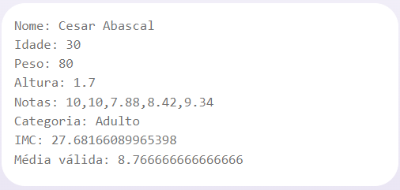

# Dados dos Atletas

> Projeto de certificação 2 – Dados dos atletas Esse projeto faz parte da "Trilha 1. Lógica de Programação", do curso DEVstart pertencente ao SENAI. Minha turma: FloripaMaisTec

## Problema Proposto

Criar uma aplicação capaz de receber informações de um atleta, bem como calcular parâmetros e exibi-los para o usuário.
Condições:
- 5 jurados avaliarão os atletas;
- Cada jurado pode fornecer uma nota de um (1) a dez (10);
- A média é calculada com base nas três notas do meio, desconsiderando a maior e menor nota.
- Categoria: Infantil: 9 a 11 anos / Juvenil: 12 e 13 anos / Intermediário: 14 e 15 anos / Adulto: 16 a 30 anos / Sem categoria: demais idades

### Especificações

Criar uma classe Atleta para concentrar os atributos e métodos dos atletas. A classe deverá receber os seguintes atributos: nome, idade, peso, altura, notas.
A média das notas não deve considerar a maior e menor nota do atleta. Por fim, apresentar ao usuário: nome, idade, peso, altura, notas, categoria, IMC e Média válida.

## Solução do Problema:

- Desenvolvimento da classe Atleta.

### Entrada da Classe: argumentos

- O argumento de criação da classe, "Atleta" é composto por 5 argumentos: nome (string), idade (int), peso (float), altura (float), notas (matriz de números float).

###### Exemplo de entrada:

>const atleta = new Atleta("nome_do_atleta",
     idade, peso, altura,
     [nota1, nota2, nota3, nota4, nota5]);

### Saída

- Exibe no console o nome do atleta, idade, peso, altura, notas, categoria, IMC e Média válida, utilizando a regra de excluir a maior e a menor nota do atleta.

###### Exemplo de saída:

>Nome: Nome Atleta
 Idade: 30
 Peso: 80
 Altura: 1.7
 Notas: 10,9.34,8.42,10,7.88
 Categoria: Adulto
 IMC: 27.68166089965398
 Média válida: 9.253333333333333

### Uso da classe

- Para usar, deve-se criar uma nova instância da classe Atleta para cada atleta, passando os 5 argumentos de entrada, conforme a entrada descrita acima.
> const atleta = new Atleta("Nome Atleta", 30, 80, 1.70, [10, 9.34, 8.42, 10, 7.88]);

- Para exibir o resultado, basta chamar o método exibirResultado() que exibirá no console os dados do atleta, conforme o modelo de saída.
> atleta.exibirResultado();

## Tecnologias

- JavaScript
- Git e Github
